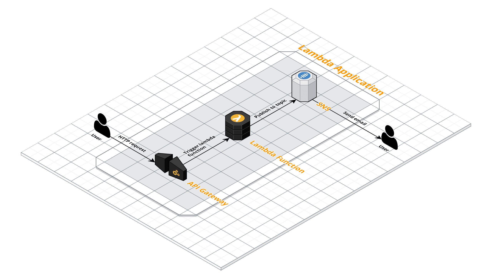

# SAM Hello World

AWS Lambda "hello world" application created with AWS [Serverless Application Model (SAM)](https://github.com/awslabs/serverless-application-model).

## Application

## Steps

This repository includes intermediate steps of the final application:

- [sam-hello-world-1](sam-hello-world-1)
- [sam-hello-world-2](sam-hello-world-2)
- [sam-hello-world-3](sam-hello-world-3)
